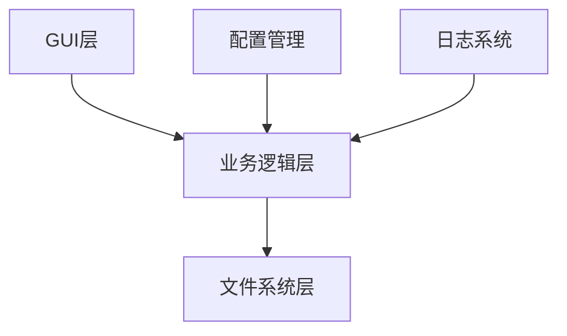
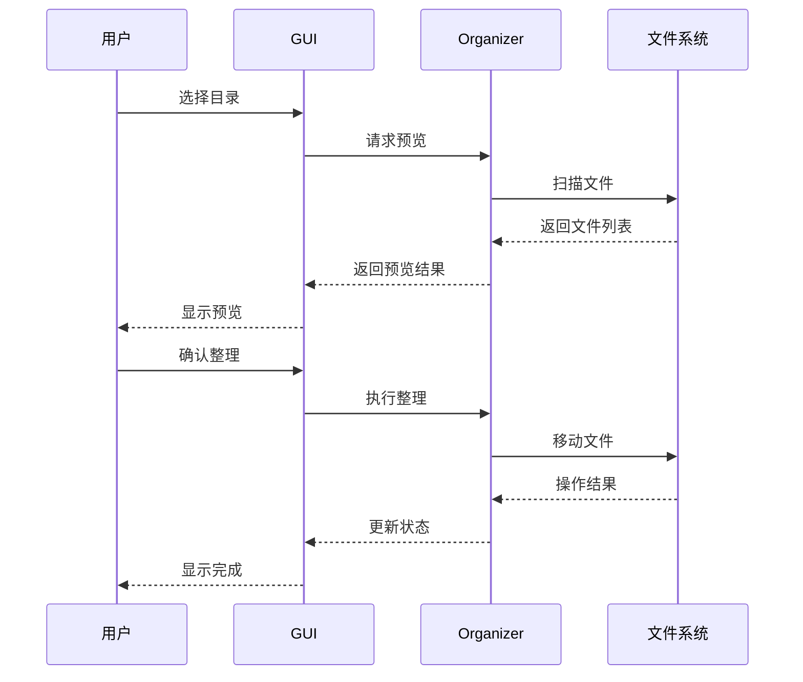
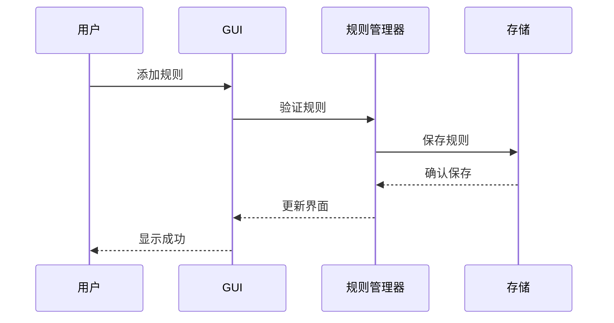

# 智能文件整理工具设计文档

## 目录

1. [系统架构](#系统架构)
2. [用户界面设计](#用户界面设计)
3. [数据流设计](#数据流设计)
4. [模块设计](#模块设计)
5. [存储设计](#存储设计)
6. [安全设计](#安全设计)

## 系统架构

### 整体架构



### 分层说明

1. GUI层
   - 负责用户交互
   - 展示操作结果
   - 处理用户输入

2. 业务逻辑层
   - 实现核心功能
   - 处理文件分类
   - 管理操作历史

3. 文件系统层
   - 执行文件操作
   - 读写配置文件
   - 管理日志文件

### 核心组件

1. FileOrganizer
   - 文件分类引擎
   - 规则管理器
   - 操作历史记录器

2. GUI组件
   - 主窗口管理器
   - 对话框控制器
   - 进度显示器

3. 工具组件
   - 日志管理器
   - 配置读写器
   - 错误处理器

## 用户界面设计

### 主窗口布局

```
+----------------------------------+
|  文件整理工具                    |
+----------------------------------+
| [选择目录] [预览] [开始整理]    |
+----------------------------------+
|                                  |
|  规则列表                        |
|  +----------------------------+  |
|  | 类别  | 扩展名  | 操作    |  |
|  |----------------------------+  |
|  | 文档  | .doc   | [编辑]   |  |
|  | 图片  | .jpg   | [删除]   |  |
|  +----------------------------+  |
|                                  |
| [添加规则] [导入] [导出]        |
+----------------------------------+
| 状态栏                          |
+----------------------------------+
```

### 对话框设计

1. 添加规则对话框
```
+------------------------+
| 添加新规则            |
+------------------------+
| 类别名称：[         ] |
| 文件扩展名：[       ] |
|                        |
| [确定]    [取消]      |
+------------------------+
```

2. 预览对话框
```
+------------------------+
| 整理预览              |
+------------------------+
| 文档 (3个文件)        |
| - report.doc          |
| - note.pdf            |
| - memo.txt            |
|                        |
| 图片 (2个文件)        |
| - photo.jpg           |
| - screenshot.png      |
|                        |
| [开始整理]  [取消]    |
+------------------------+
```

### 交互设计

1. 拖放支持
   - 支持拖拽文件夹到主窗口
   - 支持拖拽规则调整顺序

2. 快捷键
   - Ctrl+O：选择目录
   - Ctrl+P：预览
   - Ctrl+R：开始整理
   - Ctrl+Z：撤销
   - Ctrl+N：新建规则

3. 右键菜单
   - 编辑规则
   - 删除规则
   - 启用/禁用规则
   - 复制规则

### 视觉设计

1. 配色方案
```css
/* 主题色 */
--primary-color: #2196F3;
--secondary-color: #FFC107;
--background-color: #FFFFFF;
--text-color: #333333;
--border-color: #E0E0E0;
```

2. 字体设计
```css
/* 字体 */
--title-font: "Microsoft YaHei", sans-serif;
--body-font: "SimSun", serif;
--code-font: "Consolas", monospace;
```

3. 图标设计
   - 使用Material Design图标
   - 统一图标大小：24x24px
   - 支持高DPI显示

## 数据流设计

### 文件整理流程



### 规则管理流程



## 模块设计

### GUI模块

1. 主窗口类
```python
class MainWindow:
    def __init__(self):
        self.init_ui()
        self.setup_events()
        
    def init_ui(self):
        # 初始化界面组件
        
    def setup_events(self):
        # 设置事件处理
```

2. 对话框类
```python
class RuleDialog:
    def __init__(self, parent):
        self.init_ui()
        
    def validate_input(self):
        # 验证用户输入
        
    def get_result(self):
        # 获取对话框结果
```

### 文件整理模块

1. 整理引擎
```python
class FileEngine:
    def __init__(self):
        self.rules = []
        self.history = []
        
    def organize(self, path):
        # 执行文件整理
        
    def preview(self, path):
        # 生成预览结果
```

2. 规则管理器
```python
class RuleManager:
    def __init__(self):
        self.load_rules()
        
    def add_rule(self, rule):
        # 添加新规则
        
    def validate_rule(self, rule):
        # 验证规则有效性
```

## 存储设计

### 配置文件格式

```json
{
    "version": "1.0",
    "rules": [
        {
            "category": "文档",
            "extensions": [".doc", ".pdf"],
            "enabled": true
        },
        {
            "category": "图片",
            "extensions": [".jpg", ".png"],
            "enabled": true
        }
    ],
    "settings": {
        "create_missing_folders": true,
        "skip_existing_files": false,
        "backup_before_move": true
    }
}
```

### 日志格式

```
[2025-01-20 10:30:15] INFO: 程序启动
[2025-01-20 10:30:16] INFO: 加载规则文件
[2025-01-20 10:30:20] DEBUG: 扫描目录: D:/Downloads
[2025-01-20 10:30:21] INFO: 找到15个文件待处理
[2025-01-20 10:30:22] WARNING: 跳过已存在文件: report.doc
```

## 安全设计

### 文件操作安全

1. 权限检查
   - 检查目录访问权限
   - 验证文件写入权限
   - 确保目标路径安全

2. 数据保护
   - 自动备份重要文件
   - 防止意外覆盖
   - 支持操作撤销

3. 错误处理
   - 捕获所有异常
   - 提供错误恢复机制
   - 保持数据一致性

### 配置安全

1. 文件验证
   - 检查配置文件完整性
   - 验证JSON格式
   - 处理格式错误

2. 默认配置
   - 提供安全的默认值
   - 防止配置文件损坏
   - 自动修复错误

### 日志安全

1. 日志管理
   - 限制日志文件大小
   - 自动归档旧日志
   - 保护敏感信息

2. 错误日志
   - 记录详细错误信息
   - 不暴露系统信息
   - 便于问题诊断 