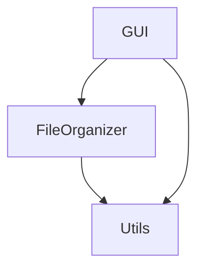

# 智能文件整理工具开发者指南

## 目录

1. [开发环境配置](#开发环境配置)
2. [项目架构](#项目架构)
3. [核心模块](#核心模块)
4. [API文档](#api文档)
5. [开发规范](#开发规范)
6. [测试指南](#测试指南)
7. [发布流程](#发布流程)

## 开发环境配置

### 基本要求

- Python 3.6+
- Git
- 文本编辑器或IDE（推荐VS Code或PyCharm）
- 虚拟环境工具（推荐venv或conda）

### 环境搭建

1. 克隆仓库：
```bash
git clone https://github.com/yourusername/file-organizer.git
cd file-organizer
```

2. 创建虚拟环境：
```bash
python -m venv venv
# Windows
venv\Scripts\activate
# Linux/macOS
source venv/bin/activate
```

3. 安装依赖：
```bash
pip install -r requirements.txt
pip install -r requirements-dev.txt  # 开发依赖
```

### IDE配置

VS Code推荐扩展：
- Python
- Pylance
- Python Test Explorer
- GitLens

PyCharm配置：
- 启用PEP8检查
- 配置项目解释器为虚拟环境
- 启用自动格式化

## 项目架构

### 目录结构

```
project/
├── src/
│   ├── gui.py          # 图形界面实现
│   ├── file_organizer.py # 核心功能实现
│   └── utils.py        # 工具函数
├── tests/              # 测试文件
├── docs/              # 文档
├── assets/            # 资源文件
├── config/            # 配置文件
└── logs/              # 日志文件
```

### 模块依赖关系



## 核心模块

### GUI模块 (gui.py)

主要类：`FileOrganizerGUI`

职责：
- 提供图形用户界面
- 处理用户输入
- 显示操作结果
- 管理界面状态

关键方法：
```python
class FileOrganizerGUI:
    def __init__(self):
        # 初始化GUI组件
        
    def _browse_directory(self):
        # 选择目录
        
    def _load_rules(self):
        # 加载分类规则
        
    def _add_rule_dialog(self):
        # 添加规则对话框
```

### 文件整理模块 (file_organizer.py)

主要类：`FileOrganizer`

职责：
- 文件分类逻辑
- 规则管理
- 文件操作
- 历史记录

关键方法：
```python
class FileOrganizer:
    def organize_directory(self, directory: str) -> None:
        # 整理指定目录
        
    def preview_organization(self, directory: str) -> dict:
        # 预览整理结果
        
    def undo_last_operation(self) -> bool:
        # 撤销上次操作
```

### 工具模块 (utils.py)

职责：
- 提供通用工具函数
- 日志记录
- 文件操作辅助
- 错误处理

主要函数：
```python
def get_file_extension(file_path: str) -> str:
    # 获取文件扩展名

def create_directory_if_not_exists(path: str) -> None:
    # 创建目录（如不存在）

def setup_logging() -> logging.Logger:
    # 配置日志系统
```

## API文档

### FileOrganizer类

#### 构造函数

```python
def __init__(self, rules_file: str = None)
```

参数：
- `rules_file`: 规则文件路径（可选）

#### 主要方法

1. 整理目录
```python
def organize_directory(
    self,
    directory: str,
    progress_callback: Callable[[int, int], None] = None
) -> None
```

参数：
- `directory`: 要整理的目录路径
- `progress_callback`: 进度回调函数（可选）

返回：
- None

异常：
- `FileNotFoundError`: 目录不存在
- `PermissionError`: 权限不足

2. 预览整理
```python
def preview_organization(self, directory: str) -> dict
```

参数：
- `directory`: 要预览的目录路径

返回：
- `dict`: 预览结果，格式为 `{category: [files]}`

3. 撤销操作
```python
def undo_last_operation(self) -> bool
```

返回：
- `bool`: 撤销是否成功

### FileOrganizerGUI类

#### 构造函数

```python
def __init__(self)
```

#### 主要方法

1. 浏览目录
```python
def _browse_directory(self) -> None
```

2. 加载规则
```python
def _load_rules(self) -> None
```

3. 添加规则
```python
def _add_rule_dialog(self) -> None
```

## 开发规范

### 代码风格

遵循PEP 8规范：
- 使用4空格缩进
- 行长度限制在79字符
- 使用snake_case命名函数和变量
- 使用CamelCase命名类

### 文档规范

- 所有公共API都需要docstring
- 使用Google风格的docstring
- 包含参数说明、返回值和异常信息

示例：
```python
def organize_directory(self, directory: str) -> None:
    """
    整理指定目录下的文件。

    Args:
        directory: 要整理的目录路径。

    Raises:
        FileNotFoundError: 目录不存在。
        PermissionError: 没有足够的权限。
    """
```

### Git提交规范

提交信息格式：
```
<type>(<scope>): <subject>

<body>

<footer>
```

类型（type）：
- feat: 新功能
- fix: 修复bug
- docs: 文档更新
- style: 代码格式
- refactor: 重构
- test: 测试
- chore: 构建过程或辅助工具的变动

### 分支管理

- main: 主分支，保持稳定
- develop: 开发分支
- feature/*: 功能分支
- bugfix/*: 修复分支
- release/*: 发布分支

## 测试指南

### 单元测试

使用pytest框架：
```bash
pytest tests/
```

测试文件命名：
- `test_*.py`
- `*_test.py`

示例测试：
```python
def test_organize_directory():
    organizer = FileOrganizer()
    # 测试代码
```

### 集成测试

测试关键功能流程：
1. 规则加载
2. 文件整理
3. 撤销操作
4. GUI操作

### 性能测试

测试场景：
- 大量文件处理
- 复杂规则匹配
- GUI响应时间

## 发布流程

1. 版本号更新
   - 遵循语义化版本
   - 更新CHANGELOG.md

2. 测试验证
   - 运行所有测试
   - 手动测试关键功能
   - 检查文档更新

3. 构建发布
   - 创建发布分支
   - 打包代码
   - 生成可执行文件

4. 发布检查清单
   - [ ] 版本号更新
   - [ ] 更新日志完善
   - [ ] 测试通过
   - [ ] 文档更新
   - [ ] 依赖列表更新 