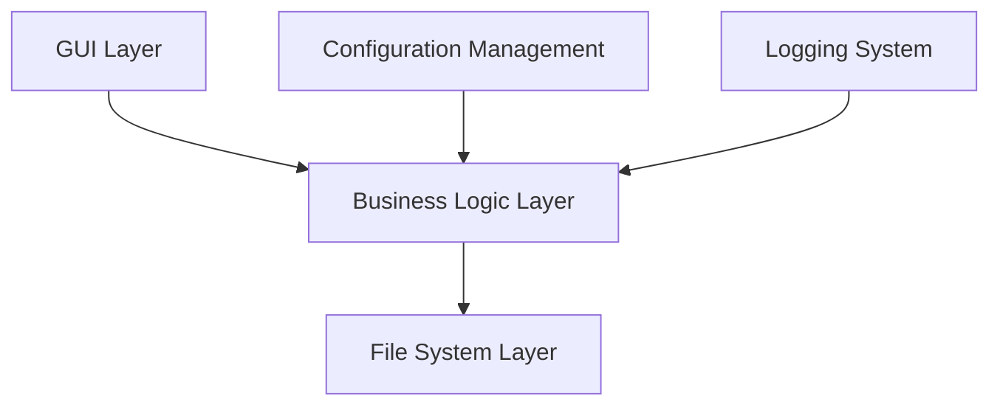
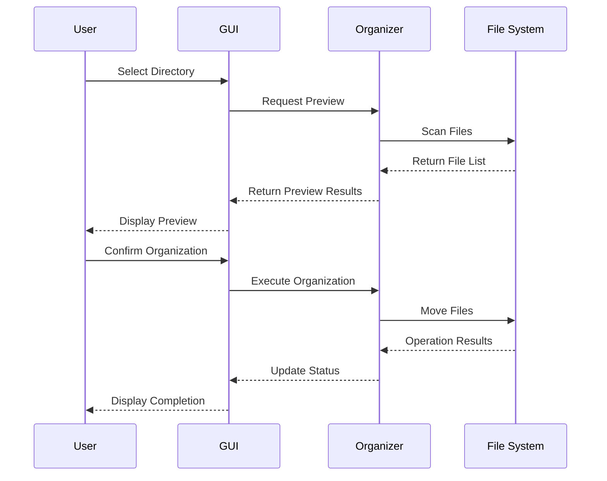
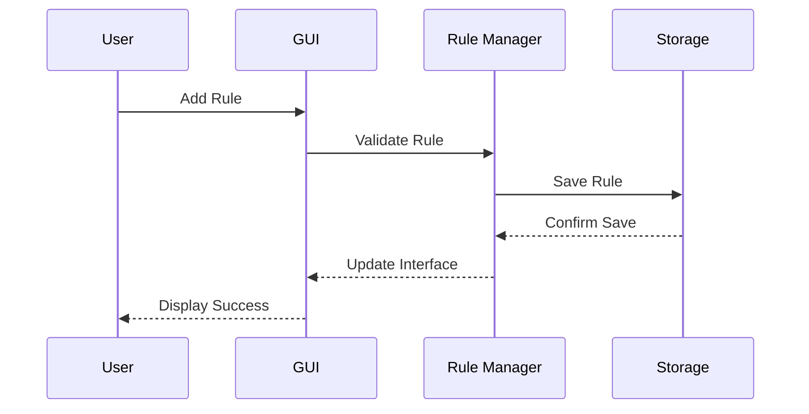

# Intelligent File Organizer Design Document

## Table of Contents

1. [System Architecture](#system-architecture)
2. [User Interface Design](#user-interface-design)
3. [Data Flow Design](#data-flow-design)
4. [Module Design](#module-design)
5. [Storage Design](#storage-design)
6. [Security Design](#security-design)

## System Architecture

### Overall Architecture



### Layer Description

1. GUI Layer
   - Handles user interaction
   - Displays operation results
   - Processes user input

2. Business Logic Layer
   - Implements core functionality
   - Handles file classification
   - Manages operation history

3. File System Layer
   - Executes file operations
   - Reads/writes configuration files
   - Manages log files

### Core Components

1. FileOrganizer
   - File classification engine
   - Rule manager
   - Operation history recorder

2. GUI Components
   - Main window manager
   - Dialog controller
   - Progress display

3. Utility Components
   - Log manager
   - Configuration reader/writer
   - Error handler

## User Interface Design

### Main Window Layout

```
+----------------------------------+
|  File Organizer                  |
+----------------------------------+
| [Select Dir] [Preview] [Start]   |
+----------------------------------+
|                                  |
|  Rule List                       |
|  +----------------------------+  |
|  | Category | Ext    | Action |  |
|  |----------------------------+  |
|  | Docs     | .doc   | [Edit] |  |
|  | Images   | .jpg   | [Del]  |  |
|  +----------------------------+  |
|                                  |
| [Add Rule] [Import] [Export]     |
+----------------------------------+
| Status Bar                       |
+----------------------------------+
```

### Dialog Design

1. Add Rule Dialog
```
+------------------------+
| Add New Rule          |
+------------------------+
| Category: [         ] |
| Extensions: [       ] |
|                        |
| [OK]      [Cancel]    |
+------------------------+
```

2. Preview Dialog
```
+------------------------+
| Organization Preview   |
+------------------------+
| Documents (3 files)    |
| - report.doc          |
| - note.pdf            |
| - memo.txt            |
|                        |
| Images (2 files)       |
| - photo.jpg           |
| - screenshot.png      |
|                        |
| [Start]    [Cancel]   |
+------------------------+
```

### Interaction Design

1. Drag and Drop Support
   - Support folder drag to main window
   - Support rule order adjustment by dragging

2. Keyboard Shortcuts
   - Ctrl+O: Select directory
   - Ctrl+P: Preview
   - Ctrl+R: Start organization
   - Ctrl+Z: Undo
   - Ctrl+N: New rule

3. Right-Click Menu
   - Edit rule
   - Delete rule
   - Enable/Disable rule
   - Copy rule

### Visual Design

1. Color Scheme
```css
/* Theme Colors */
--primary-color: #2196F3;
--secondary-color: #FFC107;
--background-color: #FFFFFF;
--text-color: #333333;
--border-color: #E0E0E0;
```

2. Font Design
```css
/* Fonts */
--title-font: "Microsoft YaHei", sans-serif;
--body-font: "SimSun", serif;
--code-font: "Consolas", monospace;
```

3. Icon Design
   - Use Material Design icons
   - Unified icon size: 24x24px
   - Support high DPI display

## Data Flow Design

### File Organization Process



### Rule Management Process



## Module Design

### GUI Module

1. Main Window Class
```python
class MainWindow:
    def __init__(self):
        self.init_ui()
        self.setup_events()
        
    def init_ui(self):
        # Initialize interface components
        
    def setup_events(self):
        # Set up event handlers
```

2. Dialog Class
```python
class RuleDialog:
    def __init__(self, parent):
        self.init_ui()
        
    def validate_input(self):
        # Validate user input
        
    def get_result(self):
        # Get dialog results
```

### File Organization Module

1. Organization Engine
```python
class FileEngine:
    def __init__(self):
        self.rules = []
        self.history = []
        
    def organize(self, path):
        # Execute file organization
        
    def preview(self, path):
        # Generate preview results
```

2. Rule Manager
```python
class RuleManager:
    def __init__(self):
        self.load_rules()
        
    def add_rule(self, rule):
        # Add new rule
        
    def validate_rule(self, rule):
        # Validate rule validity
```

## Storage Design

### Configuration File Format

```json
{
    "version": "1.0",
    "rules": [
        {
            "category": "Documents",
            "extensions": [".doc", ".pdf"],
            "enabled": true
        },
        {
            "category": "Images",
            "extensions": [".jpg", ".png"],
            "enabled": true
        }
    ],
    "settings": {
        "create_missing_folders": true,
        "skip_existing_files": false,
        "backup_before_move": true
    }
}
```

### Log Format

```
[2025-01-20 10:30:15] INFO: Program started
[2025-01-20 10:30:16] INFO: Loading rule file
[2025-01-20 10:30:20] DEBUG: Scanning directory: D:/Downloads
[2025-01-20 10:30:21] INFO: Found 15 files to process
[2025-01-20 10:30:22] WARNING: Skipping existing file: report.doc
```

## Security Design

### File Operation Security

1. Permission Checks
   - Check directory access permissions
   - Verify file write permissions
   - Ensure target path safety

2. Data Protection
   - Automatic backup of important files
   - Prevent accidental overwriting
   - Support operation undo

3. Error Handling
   - Catch all exceptions
   - Provide error recovery mechanism
   - Maintain data consistency

### Configuration Security

1. File Validation
   - Check configuration file integrity
   - Validate JSON format
   - Handle format errors

2. Default Configuration
   - Provide safe default values
   - Prevent configuration file corruption
   - Automatic error repair

### Log Security

1. Log Management
   - Limit log file size
   - Automatically archive old logs
   - Protect sensitive information

2. Error Logging
   - Record detailed error information
   - Don't expose system information
   - Facilitate problem diagnosis 